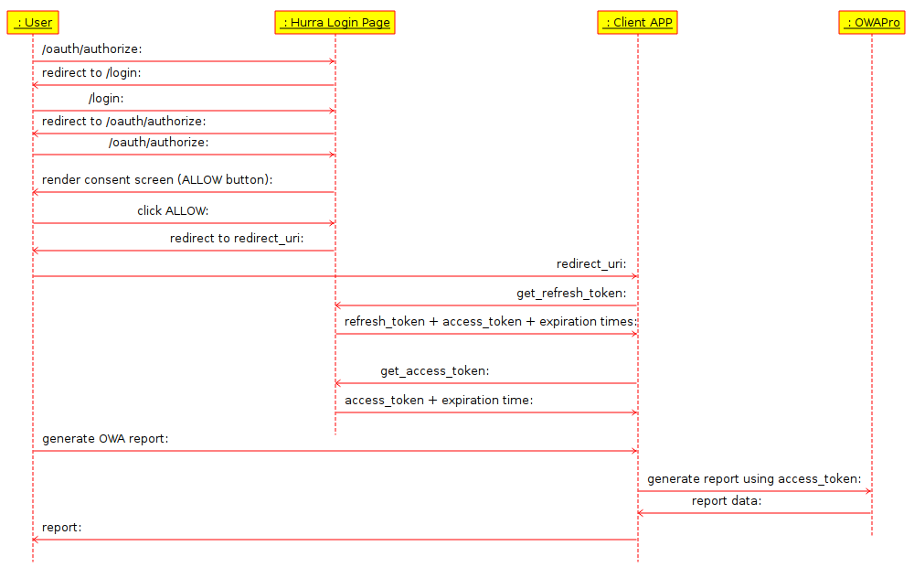

# Introduction

Welcome to the OWAPro Reporting API, a service that provides developers with RESTful access to marketing and tracking data available on the OWAPro platform.

## Who should read this

This documentation is intended for programmers who are developing apps to access OWAPro Reporting data. A prerequisite for working with the OWAPro Reporting API is an understanding of JSON and query languages.

## What is OWAPro Reporting

It's a monitoring and controlling tool for digital marketing agencies and individual ecommerce clients. The platform integrates advertising costs, conversions, and traffic sources to your website, thus helping you analyze and enhance the effectiveness of your campaigns.

## Why use it as a developer

Our Reporting API lets you retrieve advertiser data programmatically so you can easily integrate OWAPro statistics into your internal system.

All OWAPro Reporting UI reports are available through our API. The latter lets you get any information in a more flexible way. Skipping the UI step is a major time-saving advantage if you use data from our platform in your system.

We encourage you to take advantage of the Reporting API as the amount of advertising data continues to increase rapidly, and our platform enables you to carry out an analysis of your ecommerce business's marketing costs in one place.

## Key benefits

The OWAPro Reporting API lets you:

* read real-time data for specific customers and trackgroups
* be flexible in configuring complex multi-tab reports
* retrieve metrics that are grouped by trackgroups, devices, or tags
* query reporting at different structure levels and fetch reports in CSV format

## How to navigate the API

* Before getting to any API calls, explore the sections which describe topics dealing with Authentication and Authorization.
* Next, you’ll want to study and understand the OWAPro Reporting RESTful objects - customer, trackgroup, and config - and their relationships in the OWAPro Reporting API data model.
* Drill down to topics like Reports, which introduce you to query cubes, or pre-defined collections of fields that let you define the context of your report.
* To learn about tips and techniques for working with the OWAPro Reporting API, check out Best Practices. The best practices are grouped into categories that are intended to optimize and advance your efforts in working with our API.
* The FAQs are grouped into multiple categories for easier navigation and retrieval of topic-specific information. You’ll find them in various sections dedicated to a particular topic.

# Getting Started

## 1. Register Your App

### Step 1

Contact your Account Manager or us directly to integrate your app with OWAPro by providing us the following data:

> An example of the Redirect URI your define:

```shell
https://dev.yourcompany.com/oauth/connect?code=<AUTH_CODE>
```

* `redirect_uri`, we require https protocol and `code=<AUTH_CODE>` query parameter - We’ll pass you the access token in the response (learn more <a href="#oauth-2-0">here</a>)
* Identifier (name & surname) of the OWAPro user to whom the app should be assigned.
* Email address to which we'll send you the client ID and secret.

### Step 2

> An email we send looks like this:

```
Dear Client,
Thank you for registering your app. Here are the two strings you'll use to authenticate your access to the OWAPro Reporting API:
- client_id: xxxxxxxxx
- client_secret: yyyyyyy

To proceed, direct an OWAPro user to https://account.hurra.com/oauth/authorize?client_id=xxxxxxxxx&response_type=code.

Best regards,
The OWAPro Team
```

You get an email with the following information assigned to your app:

* `client_id`
* `client_secret`

Those are confidential, please do not share them with unauthorized people. You’ll use them to generate access/refresh tokens.

## 2. Generate an Access Token

<aside class="notice">Notes:<li>Register your app before generating an access token (see the <a href="#1-connect-your-app">Authenticate section</a>)<li>Access tokens are unique to an OWAPro user and should be stored securely.</aside>
<aside class="endpointnotice"><span style="font-size:20px">Authentication requests must be done to <b>https://account.hurra.com</b></span></aside>

### Step 1

Direct the OWAPro user to the URL provided in the email from OWAPro. (Optionally, you can pass the `state` parameter which will be included unchanged in the redirect.) The user will be asked whether OWAPro should grant your app access to OWAPro Reporting on that user’s behalf.

### Step 2

If the user grants your app access to OWAPro Reporting, we will use the Redirect URI to provide you a code and a refresh token, both of which you will need to get an access token (see the next step).

Note: You acquire an access token along with the first response to the Redirect URI. Any further responses to the Redirect URI provide you only a code and a refresh token.

### Step 3

These are the endpoints to use in the cases of the expiration of your access token (24 hours) and refresh token (1 year).

>Example request:

```shell
curl -X POST \
--url https://account.hurra.com/oauth/get_access_token \
--header 'Content-Type: application/x-www-form-urlencoded' \
-d refresh_token={refresh_token} \
-d client_id={client_id}
```

<aside class="postmethod"><span style="font-size:20px"><b>POST</b> /oauth/get_access_token</span></aside>

Generates an access token.

##### BODY REQUESTS
|||
|:-|-|
|`refresh_token`|The most recent refresh token.|
|`client_id`|The client ID received in an email from OWAPro.|

<aside class="postmethod"><span style="font-size:20px"><b>POST</b> /oauth/get_refresh_token</span></aside>

> Example request:

```shell
curl -X POST \
--url https://account.hurra.com/oauth/get_refresh_token \
--header 'Content-Type: application/x-www-form-urlencoded' \
-d code=AUTH_CODE \
-d client_id=CLIENT_ID \
-d client_secret=CLIENT_SECRET
```

Generates a refresh token. To request one, you need to direct the OWAPro user again through the URL sent by us in the email (see Step 3 above) to obtain an authentication code.

##### BODY REQUESTS
|||
|:-|-|
|`code`|The authentication code received in your Redirect URI.|
|`client_id`|The client ID received in an email from OWAPro.|
|`client_secret`|The client secret key received in an email from OWAPro.|

Note that each of the authentication endpoints:

* must be an HTTP POST request
* is only available over SSL on `https://account.hurra.com/`.

## 3. Learn About Reports

## 4. Learn About Endpoints

## 5. Authenticate

> Pass your access token in each request to the OWAPro Reporting API:

```shell
curl "api_endpoint_here"
  -H "Authorization: Bearer {access_token}"
```

> Make sure to replace *{access_token}* with your access token.

An access token is required to be passed in a request header along with any API call. A header looks like the following:

`Authorization: Bearer {access_token}`

# Authentication & Authorization

The OWAPro Reporting API uses the OAuth 2.0. If you are not a developer, you can use our API just having an active owapro.hurra.com session.

## OAuth 2.0

The following diagram presents our OAuth 2.0.



Learn more about OAuth 2.0 [here](https://www.oauth.com).

### Redirect URI

> The final URL may look like this:

```html
https://dev.yourcompany.com/oauth/connect?code=0123456789
```

> The server response may look like this:

```json
    {
    "refresh_token": {
        "token": "oif2341jaI578O6FAsifsiAOF21341JISAO786f5iofj90SI87OFJAIO121FjfHG",
        "expires_in": 31536000, # 1 year
    },
    "access_token": {
        "token": "IJFISOAjidsa2134IGOJS214NKXCN332aDISAOJGA1234DJGIS32141ISAJFI112",
        "expires_in": 86400, # 24 hours
    },
    "token_type": "Bearer"
    }
```

The email received from OWAPro includes, along with client ID and secret, a URL to which you have to direct an OWAPro user to allow the app access our API on that user's behalf. After the user has granted your app access, we respond to the Redirect URI you have defined while connecting your app with OWAPro.

The response populates the `code` URL parameter, which provides a 5-min valid code that, any time after that first authentication, will let you request an access token.

To summarize, we use Redirect URI to pass you, but only the first time, the following:

Code/Token|Where|Purpose|Expiration
-|-|-|-
Authentication code|URL|A one-time use code to get tokens|5 mins
Refresh token|Response|Used to generate an access token|1 year
Access token|Response|Authenticates access to the API<br>(One is provided along with our first response to the Redirect URI)|24 hrs

You need to request the URL from the email before each time you are to generate a new access token or refresh token.

## API for OWAPro Users

Every user that has their session active on https://owapro.hurra.com (based on the `HASID` cookie) can make calls to the OWAPro Reporting API. No further authentication is needed.

This solution has been prepared for OWAPro users that are not developers. It lets them fetch OWAPro data while working simultaneously in some other apps (as Google Sheets).

Requests done to the OWAPro Reporting API read cookies saved in your browser. If the `HASID` cookie is active, you are authenticated and authorized to get data.

## Authorization

Responses the OWAPro user gets from the OWAPro Reporting API (e.g., `customer` or `config`) are limited by the access rights the OWAPro user has been granted within the OWAPro system.

The OWAPro user, as seen in Step 3 of the OAuth 2.0 section, is the one (logged into our platform) that allows OWAPro to connect with your app. As a result, **code**, **refresh token**, and **access token** are assigned to that OWAPro user.

The URL mentioned in Step 3 of the OAuth 2.0 section can be reused by multiple users and each of them will get, once they allow OWAPro to access your app, a unique set of **code**, **refresh token**, and **access token**.
